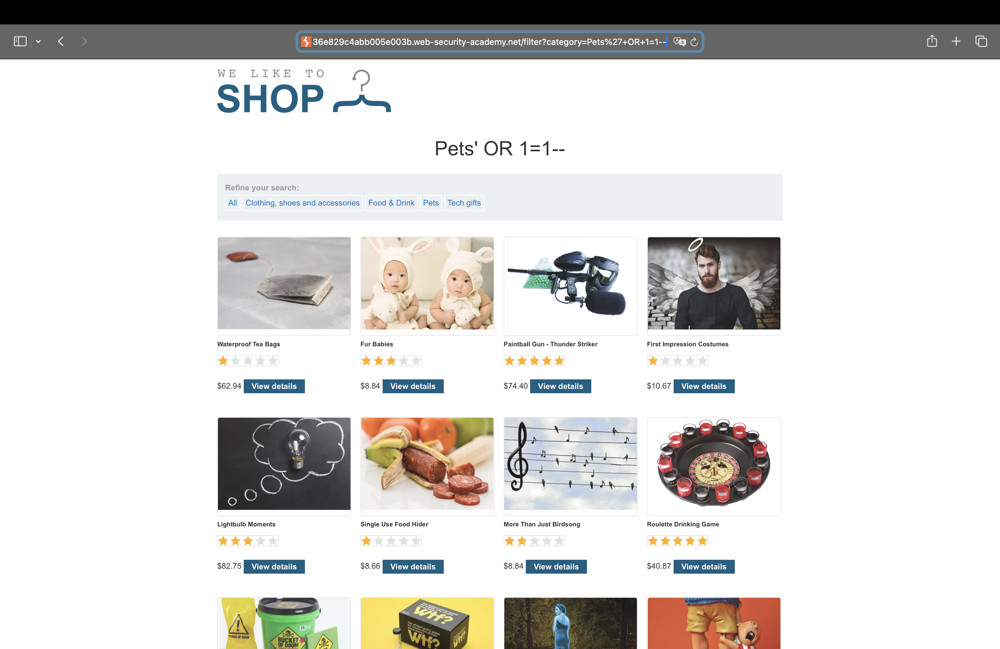

# SQL Injection
This documentation is provided by Mahsa Hakimi.

Source: [https://portswigger.net/web-security/sql-injection](https://portswigger.net/web-security/sql-injection)

---

<div dir="rtl">

# تزریق SQL
موضوعاتی که در اینجا به آن‌ها خواهیم پرداخت:
- تزریق SQL (SQLi) چیست.
- چگونه انواع مختلف آسیب‌پذیری‌های SQLi را پیدا و استفاده کنیم.
- چگونه از تزریق SQL جلوگیری کنیم.

</div>


<div dir="rtl">

# تزریق SQL (SQLi) چیست؟
تزریق SQL (SQLi) یک آسیب‌پذیری امنیتی در وب است که به مهاجم اجازه می‌دهد در کوئری‌هایی که یک برنامه به پایگاه داده خود ارسال می‌کند، تداخل ایجاد کند. این امر می‌تواند به مهاجم امکان مشاهده داده‌هایی را بدهد که به طور معمول قادر به دسترسی به آن‌ها نیست. این داده‌ها ممکن است شامل اطلاعات متعلق به کاربران دیگر یا هر داده دیگری باشد که برنامه به آن دسترسی دارد. در بسیاری از موارد، مهاجم می‌تواند این داده‌ها را تغییر یا حذف کند، که باعث ایجاد تغییرات پایدار در محتوا یا رفتار برنامه می‌شود.

در برخی شرایط، مهاجم می‌تواند یک حمله تزریق SQL را تشدید کرده و سرور زیرین یا سایر زیرساخت‌های back-end را به خطر بیندازد. همچنین این حمله می‌تواند به مهاجم امکان انجام حملات محروم‌سازی از سرویس (Denial-of-Service) را بدهد.

# تأثیر یک حمله تزریق SQL موفق چیست؟
یک حمله تزریق SQL موفق می‌تواند منجر به دسترسی غیرمجاز به داده‌های حساس شود، از جمله:
- رمزهای عبور.
- جزئیات کارت‌های اعتباری.
- اطلاعات شخصی کاربران.

حمله‌های تزریق SQL در سال‌های اخیر در بسیاری از نقض‌های داده‌ای پرتکرار مورد استفاده قرار گرفته‌اند. این حملات باعث آسیب به اعتبار و جریمه‌های نظارتی شده‌اند. در برخی موارد، مهاجم می‌تواند یک درپشتی (backdoor) پایدار در سیستم‌های یک سازمان ایجاد کند، که منجر به یک compromise بلندمدت می‌شود و ممکن است برای مدت طولانی بدون توجه باقی بماند.

# چگونه آسیب‌پذیری‌های تزریق SQL را تشخیص دهیم؟
شما می‌توانید آسیب‌پذیری‌های تزریق SQL را به صورت دستی با استفاده از یک مجموعه سیستماتیک از تست‌ها برای هر نقطه ورودی در برنامه تشخیص دهید. برای این کار، معمولاً موارد زیر را ارسال می‌کنید:
- کاراکتر `'` و به دنبال خطاها یا ناهنجاری‌های دیگر باشید.
- برخی از دستورات خاص SQL که به مقدار پایه (اصلی) نقطه ورودی ارزیابی می‌شوند و به یک مقدار متفاوت، و به دنبال تفاوت‌های سیستماتیک در پاسخ‌های برنامه باشید.
- شرایط بولین مانند `OR 1=1` و `OR 1=2`، و به دنبال تفاوت‌ها در پاسخ‌های برنامه باشید.
- Payloadهایی که طراحی شده‌اند تا تاخیرهای زمانی را هنگام اجرا در یک کوئری SQL ایجاد کنند، و به دنبال تفاوت‌ها در زمان پاسخ‌دهی باشید.
- Payloadهای OAST که طراحی شده‌اند تا یک تعامل شبکه‌ای خارج از باند (out-of-band) را هنگام اجرا در یک کوئری SQL ایجاد کنند، و هرگونه تعامل حاصل را نظارت کنید.

به طور جایگزین، شما می‌توانید اکثر آسیب‌پذیری‌های تزریق SQL را به سرعت و با اطمینان با استفاده از Burp Scanner پیدا کنید.

# تزریق SQL در بخش‌های مختلف کوئری
اکثر آسیب‌پذیری‌های تزریق SQL در بخش `WHERE` از یک کوئری `SELECT` رخ می‌دهند. بسیاری از تسترهای با تجربه با این نوع تزریق SQL آشنا هستند.

با این حال، آسیب‌پذیری‌های تزریق SQL می‌توانند در هر بخشی از کوئری و در انواع مختلف کوئری‌ها رخ دهند. برخی از مکان‌های رایج دیگر که تزریق SQL در آن‌ها اتفاق می‌افتد عبارتند از:
- در دستورات `UPDATE`، در مقادیر به‌روزشده یا بخش `WHERE`.
- در دستورات `INSERT`، در مقادیر درج‌شده.
- در دستورات `SELECT`، در نام جدول یا ستون.
- در دستورات `SELECT`، در بخش `ORDER BY`.

# نمونه های SQL injection

تعداد زیادی آسیب پذیری، حملات و تکنیک های تزریق SQL وجود دارد که در موقعیت های مختلف رخ می دهند. برخی از نمونه های رایج تزریق SQL عبارتند از:

* **بازیابی داده های پنهان (Retrieving hidden data):** در این حالت، شما می توانید یک SQL query را تغییر دهید تا نتایج اضافی را برگرداند.
* **نقض منطق برنامه (Subverting application logic):** در این حالت، شما می توانید یک query را تغییر دهید تا با منطق برنامه تداخل داشته باشد.
* **حملات UNION:** در این حالت، شما می توانید داده ها را از جداول مختلف پایگاه داده بازیابی کنید.
* **تزریق SQL کور (Blind SQL injection):** در این حالت، نتایج یک query که شما آن را کنترل می کنید، در پاسخ های برنامه برگردانده نمی شوند.

## بازیابی داده‌های پنهان 
تصور کنید یک برنامه خرید آنلاین محصولات را در دسته‌بندی‌های مختلف نمایش می‌دهد. هنگامی که کاربر روی دسته‌بندی "Gifts" کلیک می‌کند، مرورگر به آدرس زیر request می‌زند:

</div>

```https
https://insecure-website.com/products?category=Gifts
```

<div dir="rtl">

این باعث می‌شود برنامه یک کوئری SQL برای بازیابی جزئیات محصولات مرتبط از پایگاه داده اجرا کند:

</div>

```sql
SELECT * FROM products WHERE category = 'Gifts' AND released = 1
```

<div dir="rtl">

این SQL query از پایگاه داده می خواهد که موارد زیر را برگرداند:

* همه جزئیات `*`
* از جدول `products`
* جایی که دسته بندی `Gifts` است
* و `released = 1` است.

محدودیت `released = 1` برای پنهان کردن محصولاتی که منتشر نشده اند استفاده می شود. می توانیم فرض کنیم که برای محصولات منتشر نشده، `released = 0` است.

برنامه هیچ دفاعی در برابر حملات تزریق SQL پیاده سازی نمی کند. این بدان معناست که یک مهاجم می تواند حمله زیر را برای مثال انجام دهد:

</div>

```https
https://insecure-website.com/products?category=Gifts'--
```

<div dir="rtl">

این منجر به SQL query زیر می شود:

</div>

```sql
SELECT * FROM products WHERE category = 'Gifts'--' AND released = 1
```

<div dir="rtl">

نکته مهم این است که `--` یک نشانگر توضیحات (comment) در SQL است. این بدان معناست که بقیه کوئری به عنوان توضیحات تفسیر می‌شود و عملاً حذف می‌شود. در این مثال، این به معنای حذف `AND released = 1` است. در نتیجه، تمام محصولات نمایش داده می‌شوند، از جمله آن‌هایی که هنوز منتشر نشده‌اند.

شما می‌توانید از یک حمله مشابه برای نمایش تمام محصولات در هر دسته‌بندی، از جمله دسته‌بندی‌هایی که وجود آن‌ها را نمی‌دانید، استفاده کنید:

</div>

```https
https://insecure-website.com/products?category=Gifts'+OR+1=1--
```

<div dir="rtl">

این منجر به اجرای کوئری SQL زیر می‌شود:

</div>

```sql
SELECT * FROM products WHERE category = 'Gifts' OR 1=1--' AND released = 1
```

<div dir="rtl">

کوئری تغییر یافته تمام مواردی را برمی‌گرداند که یا در دسته‌بندی `Gifts` قرار دارند یا `1=1` است. از آنجایی که `1=1` همیشه درست است، کوئری تمام موارد را برمی‌گرداند.




### هشدار
هنگام تزریق شرط `OR 1=1` به یک کوئری SQL مراقب باشید. حتی اگر در زمینه‌ای که شما تزریق می‌کنید بی‌ضرر به نظر برسد، معمول است که برنامه‌ها از داده‌های یک درخواست در چندین کوئری مختلف استفاده کنند. اگر شرط شما به یک دستور UPDATE یا DELETE برسد، به عنوان مثال، ممکن است منجر به از دست رفتن تصادفی داده‌ها شود.

## نقض منطق برنامه
تصور کنید برنامه‌ای وجود دارد که به کاربران اجازه می‌دهد با نام کاربری و رمز عبور وارد سیستم شوند. اگر کاربری نام کاربری `wiener` و رمز عبور `bluecheese` را ارسال کند، برنامه اعتبارسنجی را با اجرای کوئری SQL زیر انجام می‌دهد:

</div>

```sql
SELECT * FROM users WHERE username = 'wiener' AND password = 'bluecheese'
```

<div dir="rtl">

اگر کوئری جزئیات یک کاربر را برگرداند، ورود به سیستم موفقیت‌آمیز است. در غیر این صورت، رد می‌شود.

در این حالت، یک مهاجم می‌تواند بدون نیاز به رمز عبور به عنوان هر کاربری وارد سیستم شود. آن‌ها می‌توانند از دنباله توضیحات SQL `--` برای حذف بررسی رمز عبور از بخش `WHERE` کوئری استفاده کنند. به عنوان مثال، ارسال نام کاربری `administrator'--` و یک رمز عبور خالی منجر به اجرای کوئری زیر می‌شود:

</div>

```sql
SELECT * FROM users WHERE username = 'administrator'--' AND password = ''
```

<div dir="rtl">

این کوئری کاربری را که `username` آن `administrator` است برمی‌گرداند و مهاجم با موفقیت به عنوان آن کاربر وارد سیستم می‌شود.

## بازیابی داده ها از جداول دیگر پایگاه داده

در مواردی که برنامه با نتایج یک پرس و جوی SQL پاسخ می دهد، یک مهاجم می تواند از یک آسیب پذیری تزریق SQL برای بازیابی داده ها از جداول دیگر در پایگاه داده استفاده کند. شما می توانید از کلمه کلیدی `UNION` برای اجرای یک پرس و جوی `SELECT` اضافی و اضافه کردن نتایج به پرس و جوی اصلی استفاده کنید.

به عنوان مثال، اگر یک برنامه پرس و جوی زیر را حاوی ورودی کاربر `Gifts` اجرا کند:

</div>

```sql
SELECT name, description FROM products WHERE category = 'Gifts'
```

<div dir="rtl">

یک مهاجم می تواند ورودی زیر را ارسال کند:

</div>

```sql
' UNION SELECT username, password FROM users--
```

<div dir="rtl">

این باعث می شود که برنامه همه نام های کاربری و رمزهای عبور را به همراه نام ها و توضیحات محصولات برگرداند.

## آسیب پذیری های SQL injection کور

بسیاری از موارد تزریق SQL آسیب پذیری های کور هستند. این بدان معناست که برنامه نتایج SQL query یا جزئیات هرگونه خطای پایگاه داده را در پاسخ های خود برنمی گرداند. آسیب پذیری های کور همچنان می توانند برای دسترسی به داده های غیرمجاز مورد سوء استفاده قرار گیرند، اما تکنیک های مورد استفاده به طور کلی پیچیده تر و انجام آنها دشوارتر است.

تکنیک های زیر بسته به ماهیت آسیب پذیری و پایگاه داده درگیر می توانند برای بهره برداری از آسیب پذیری های تزریق SQL کور استفاده شوند:

* **تغییر منطق query:** شما می توانید منطق query را تغییر دهید تا بسته به صحت یک شرط واحد، تفاوت قابل تشخیص در پاسخ برنامه ایجاد شود. این ممکن است شامل تزریق یک شرط جدید به برخی از منطق بولی یا تحریک مشروط یک خطا مانند divide-by-zero باشد.
* **تحریک مشروط تأخیر زمانی:** شما می توانید به صورت مشروط یک تأخیر زمانی را در پردازش query راه اندازی کنید. این امر شما را قادر می سازد تا صحت شرط را بر اساس زمانی که برنامه برای پاسخ دادن صرف می کند، استنباط کنید.
* **راه اندازی تعامل شبکه خارج از باند:** شما می توانید با استفاده از تکنیک های OAST، یک تعامل شبکه out-of-band را راه اندازی کنید. این تکنیک بسیار قدرتمند است و در شرایطی که تکنیک های دیگر کار نمی کنند، جواب می دهد. اغلب، شما می توانید مستقیماً داده ها را از طریق کانال out-of-band استخراج کنید. به عنوان مثال، می توانید داده ها را در یک جستجوی DNS برای دامنه ای که شما کنترل می کنید، قرار دهید.

# تزریق SQL درجه دوم (Second-order SQL injection)

تزریق SQL درجه اول (First-order SQL injection) زمانی رخ می دهد که برنامه ورودی کاربر را از یک درخواست HTTP پردازش می کند و ورودی را به روشی ناامن در یک SQL query قرار می دهد.

تزریق SQL درجه دوم زمانی رخ می دهد که برنامه ورودی کاربر را از یک درخواست HTTP می گیرد و آن را برای استفاده در آینده ذخیره می کند. این کار معمولاً با قرار دادن ورودی در یک پایگاه داده انجام می شود، اما هیچ آسیب پذیری در نقطه ای که داده ها ذخیره می شوند، رخ نمی دهد. بعداً، هنگام رسیدگی به یک درخواست HTTP متفاوت، برنامه داده های ذخیره شده را بازیابی می کند و آن را به روشی ناامن در یک SQL query قرار می دهد. به همین دلیل، تزریق SQL درجه دوم به عنوان تزریق SQL ذخیره شده (stored SQL injection) نیز شناخته می شود.

</div>


<div dir="rtl">

تزریق SQL مرتبه دوم اغلب در شرایطی رخ می‌دهد که توسعه‌دهندگان از آسیب‌پذیری‌های تزریق SQL آگاه هستند و بنابراین ورودی‌ها را به طور ایمن در پایگاه داده قرار می‌دهند. هنگامی که داده‌ها بعداً پردازش می‌شوند، به عنوان داده‌های ایمن در نظر گرفته می‌شوند، زیرا قبلاً به طور ایمن در پایگاه داده قرار گرفته‌اند. در این مرحله، داده‌ها به روشی ناامن پردازش می‌شوند، زیرا توسعه‌دهنده به اشتباه آن‌ها را قابل اعتماد می‌داند.

# بررسی پایگاه داده
برخی از ویژگی‌های اصلی زبان SQL در پلتفرم‌های محبوب پایگاه داده به روش یکسانی پیاده‌سازی شده‌اند، و بنابراین بسیاری از روش‌های تشخیص و بهره‌برداری از آسیب‌پذیری‌های تزریق SQL به طور یکسان در انواع مختلف پایگاه داده کار می‌کنند.

با این حال، تفاوت‌های زیادی نیز بین پایگاه‌داده‌های رایج وجود دارد. این تفاوت‌ها به این معنا هستند که برخی از تکنیک‌های تشخیص و بهره‌برداری از تزریق SQL در پلتفرم‌های مختلف به شکل متفاوتی عمل می‌کنند. به عنوان مثال:
- نحو (syntax) برای الحاق رشته‌ها.
- توضیحات (comments).
- کوئری‌های دسته‌ای یا پشته‌ای (batched or stacked queries).
- APIهای خاص پلتفرم.
- پیام‌های خطا.

پس از شناسایی آسیب پذیری تزریق SQL، اغلب مفید است که اطلاعاتی در مورد پایگاه داده به دست آورید. این اطلاعات می تواند به شما در بهره برداری از آسیب پذیری کمک کند.

شما می توانید جزئیات نسخه پایگاه داده را query کنید. روش های مختلفی برای انواع مختلف پایگاه داده وجود دارد. این بدان معناست که اگر روش خاصی را پیدا کنید که کار می کند، می توانید نوع پایگاه داده را استنباط کنید. به عنوان مثال، در اوراکل می توانید دستور زیر را اجرا کنید:

</div>

```sql
SELECT * FROM v$version
```

<div dir="rtl">

همچنین می توانید مشخص کنید که چه جداول پایگاه داده ای وجود دارد و ستون های آنها شامل چه مواردی هستند. به عنوان مثال، در اکثر پایگاه های داده می توانید پرس و جوی زیر را برای لیست کردن جداول اجرا کنید:

</div>

```SQL
SELECT * FROM information_schema.tables
```

<div dir="rtl">

# تزریق SQL در زمینه های مختلف

تا اینجا شما از query string برای تزریق SQL payload مخرب خود استفاده کردید. با این حال، شما می توانید حملات تزریق SQL را با استفاده از هر ورودی قابل کنترلی که به عنوان یک SQL query توسط برنامه پردازش می شود، انجام دهید. به عنوان مثال، برخی از وب سایت ها ورودی را به فرمت JSON یا XML می گیرند و از این برای query از پایگاه داده استفاده می کنند.

این فرمت های مختلف ممکن است راه های مختلفی را برای شما فراهم کنند تا حملاتی را که در غیر این صورت به دلیل WAF ها و سایر مکانیزم های دفاعی مسدود شده اند، مبهم کنید. پیاده سازی های ضعیف اغلب به دنبال کلمات کلیدی رایج تزریق SQL در request می گردند، بنابراین ممکن است بتوانید با رمزگذاری یا فرار از کاراکترها در کلمات کلیدی ممنوعه، این فیلترها را دور بزنید. به عنوان مثال، تزریق SQL مبتنی بر XML زیر از یک توالی فرار XML برای رمزگذاری کاراکتر S در SELECT استفاده می کند:

</div>

```xml
<stockCheck>
    <productId>123</productId>
    <storeId>999 &amp;#x53;ELECT * FROM information_schema.tables</storeId>
</stockCheck>
```

<div dir="rtl">

این در سمت سرور قبل از ارسال به مترجم SQL رمزگشایی (decoded) می شود.

# چگونه از تزریق SQL جلوگیری کنیم؟

شما می توانید با استفاده از query های پارامتری به جای اتصال string در داخل query، از بیشتر موارد تزریق SQL جلوگیری کنید. این پرس و جوهای پارامتری به عنوان "عبارات آماده" (prepared statements) نیز شناخته می شوند.

کد زیر به دلیل اتصال مستقیم ورودی کاربر به query، در برابر تزریق SQL آسیب پذیر است:

</div>

```java
String query = "SELECT * FROM products WHERE category = '"+ input + "'";
Statement statement = connection.createStatement();
ResultSet resultSet = statement.executeQuery(query);
```

<div dir="rtl">

شما می توانید این کد را به گونه ای بازنویسی کنید که از تداخل ورودی کاربر با ساختار query جلوگیری کند:

</div>

```java
PreparedStatement statement = connection.prepareStatement("SELECT * FROM products WHERE category = ?");
statement.setString(1, input);
ResultSet resultSet = statement.executeQuery();
```

<div dir="rtl">

شما می توانید از query های پارامتری برای هر موقعیتی که ورودی غیرقابل اعتماد به عنوان داده در داخل query ظاهر می شود، از جمله عبارت `WHERE` و مقادیر در یک عبارت `INSERT` یا `UPDATE` استفاده کنید. آنها نمی توانند برای رسیدگی به ورودی غیرقابل اعتماد در سایر بخش های query، مانند نام جدول یا ستون، یا عبارت `ORDER BY` استفاده شوند. عملکرد برنامه ای که داده های غیرقابل اعتماد را در این بخش های query قرار می دهد، باید رویکرد متفاوتی را اتخاذ کند، مانند:
* لیست سفید مقادیر ورودی مجاز.
* استفاده از منطق مختلف برای ارائه رفتار مورد نیاز.

برای اینکه یک query پارامتری در جلوگیری از تزریق SQL مؤثر باشد، رشته ای که در query استفاده می شود همیشه باید یک ثابت کدگذاری شده باشد. هرگز نباید حاوی هیچ داده متغیری از هر جایی باشد. وسوسه نشوید که مورد به مورد تصمیم بگیرید که آیا یک مورد داده مورد اعتماد است یا خیر، و به استفاده از اتصال رشته در داخل query برای مواردی که ایمن در نظر گرفته می شوند، ادامه دهید. به راحتی می توان در مورد منشاء احتمالی داده ها اشتباه کرد، یا تغییرات در کدهای دیگر می تواند داده های مورد اعتماد را آلوده کند.

</div>